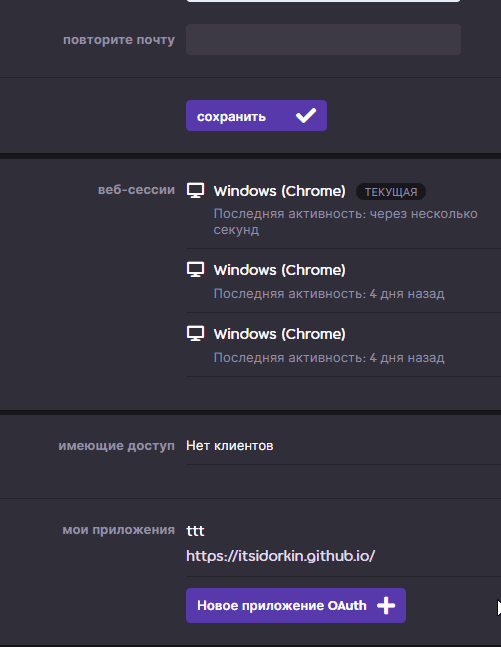
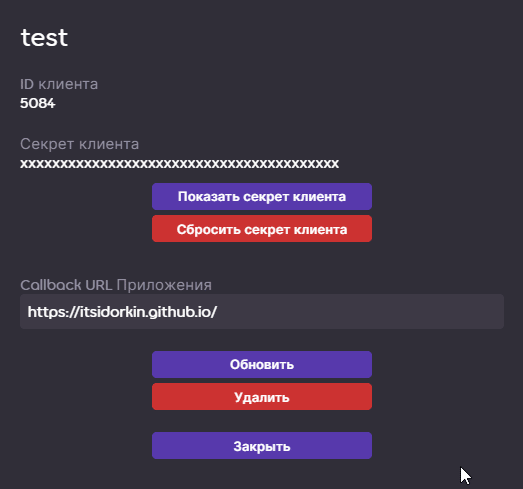
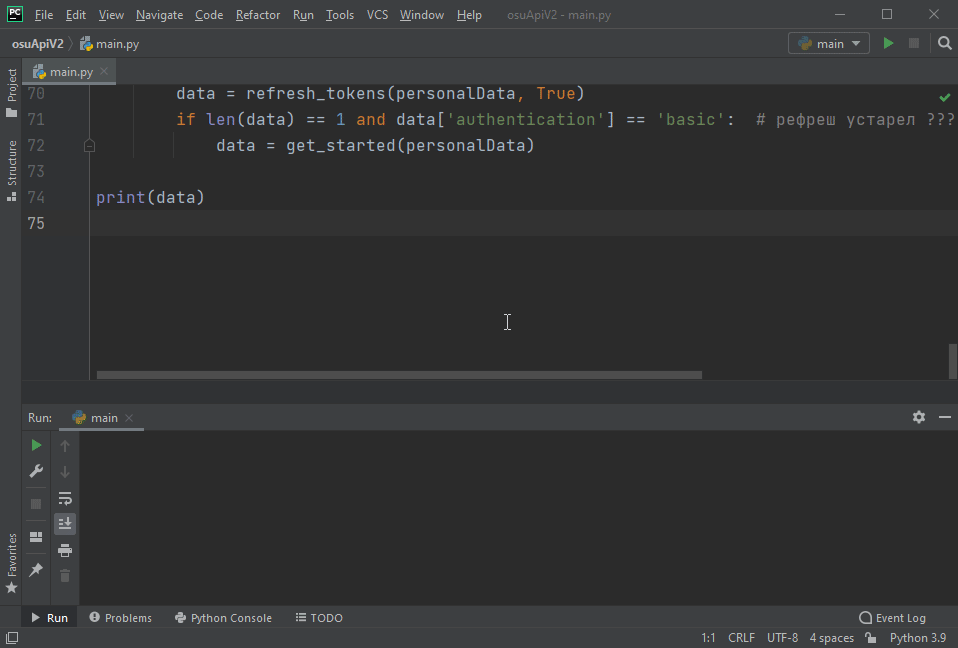

# osuApiV2
 Небольшая программа для упрощения получения токенов для api v2, а также информации о комнатах мультиплеера в osu. Ожидаем обновления api.
# Как начать?
1. Зарегистрировать приложение: заходим в [настройки](https://osu.ppy.sh/home/account/edit) аккаунта osu и листаем в самый низ. Жмем кнопку `Новое приложение OAuth`. Заполняем `Имя приложения` и `Callback URL Приложения`. Имя может быть любым. В качестве URL используем `https://itsidorkin.github.io/`.

2. В открывшемся окне нужно скопировать `ID клиента`, `Секрет клиента` и `Callback URL Приложения` и заполнить соответствующие поля в файле `personalData.json` (открыть с помощью блокнота или любого другого текстового редактора). 

3. Открыть `main.py`. Установить зависимые пакеты, если они отсутствуют. Запустить. Во время первого запуска будет открыт сайт osu! c запросом авторизации. После авторизации вас перенаправит на `https://itsidorkin.github.io/`, где нужно нажать кнопку `Копировать Code`. Данный этап происходит лишь один раз при первом запуске. В дальнейшем ваши токены будут автоматически обновляться и записываться в `personalData.json` при запуске программы. Если `refrsh_token` устареет (долго не пользоваться программой), то повториться процесс авторизации с перенаправлением.

# А что дальше?
Ничего. На данный момент osu api v2 находится на стадии разработки и неподходит для достижения моей цели. Поэтому ждем. Но если у вас другие идеи как это использовать - вперед.
